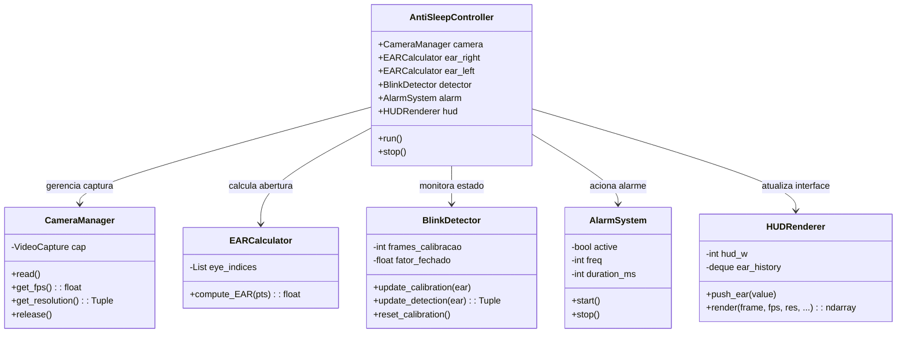
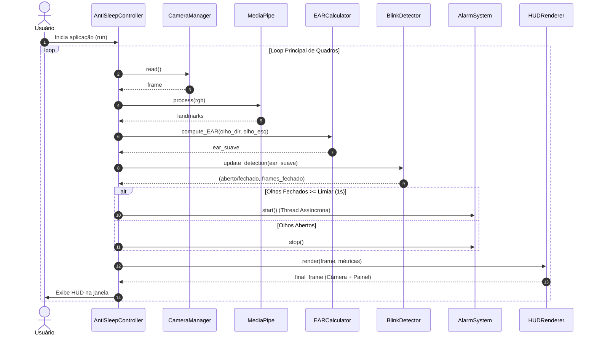

# 😴 Sistema Anti-Sono (Sonito)

> **Projeto Final da Disciplina de POO para Automação**  
> Universidade Federal de Santa Maria (**UFSM**) — Concluído em dezembro de 2025.

Software de monitoramento de fadiga e sonolência em tempo real para prevenção de acidentes e apoio cognitivo, combinando **Visão Computacional** (OpenCV + MediaPipe Face Mesh) e uma **arquitetura orientada a objetos (POO)** modular em Python.

---

## 👥 Autores

* [Daniel Schmitt](https://github.com/Im-Danel)
* [Larissa Temple](https://github.com/laritemple)

---

## 🎯 Objetivo & O Problema

A sonolência e a perda de foco ao volante ou em tarefas críticas representam riscos severos: estima-se que entre **20% e 40% dos acidentes de trânsito** estejam diretamente relacionados à fadiga e episódios de micro-sono.

O **Sistema Anti-Sono** foi projetado para:
1. Capturar o fluxo de vídeo da webcam em tempo real;
2. Extrair marcos faciais (*landmarks*) dos olhos via **MediaPipe Face Mesh**;
3. Realizar a **calibração automática** personalizada para o formato ocular do usuário durante os primeiros **20 frames** de execução;
4. Monitorar o fechamento prolongado dos olhos através da métrica **Eye Aspect Ratio (EAR)**;
5. Disparar um alarme sonoro assíncrono caso o usuário permaneça com os olhos fechados por mais de **1.0 segundo** (aprox. 30 frames a 30 FPS);
6. Renderizar um HUD lateral não invasivo com histórico gráfico do EAR, FPS e barra de progresso.

---

## 📐 O Algoritmo EAR (Eye Aspect Ratio)

O **Eye Aspect Ratio (EAR)** é uma métrica geométrica que relaciona a abertura vertical dos olhos com sua largura horizontal:

$$\text{EAR} = \frac{\|P_2 - P_6\| + \|P_3 - P_5\|}{2 \cdot \|P_1 - P_4\|}$$

* $P_1, P_4$: Cantos horizontais do olho.
* $P_2, P_3, P_5, P_6$: Pontos das pálpebras superior e inferior.

Quando o olho pisca ou fecha, a distância vertical tende a zero enquanto a largura permanece relativamente constante. Essa proporção tem a vantagem matemática de ser **invariante à distância** do rosto até a câmera.

---

## 🏗️ Arquitetura Orientada a Objetos (POO)

O projeto foi refatorado a partir de um protótipo procedural inicial para uma arquitetura orientada a objetos seguindo o **Princípio da Responsabilidade Única (SRP)**:



### Papel de cada componente:
* **`CameraManager`:** Encapsula a interface com o OpenCV e gerencia a taxa de quadros (FPS) e resolução da câmera.
* **`EARCalculator`:** Função matemática pura para cálculo da métrica com base nos 6 pontos de contorno do olho.
* **`BlinkDetector`:** Máquina de estados responsável pela calibração individual (primeiros 20 frames) e pela contagem do tempo com olhos fechados.
* **`AlarmSystem`:** Gerencia a emissão sonora em uma **Daemon Thread**, garantindo que o alerta toque de forma contínua sem travar ou reduzir o FPS da captura de vídeo.
* **`HUDRenderer`:** Renderiza uma barra lateral limpa contendo métricas, status, barra de perigo e gráfico de linha histórico usando `collections.deque` com tamanho fixo.
* **`AntiSleepController`:** Controller orquestrador principal que integra o pipeline de visão, processamento e interface.

---

## 🔄 Fluxo de Execução



---

## 📂 Estrutura de Arquivos

```
sistema-anti-sono/
├── src/
│   ├── main.py                     # Implementação final em POO
│   └── prototipo_procedural.py     # Protótipo inicial procedural (histórico)
├── requirements.txt
├── LICENSE
└── README.md
```

---

## 📜 Licença

Distribuído sob a licença MIT. Consulte o arquivo [LICENSE](LICENSE) para mais detalhes.


